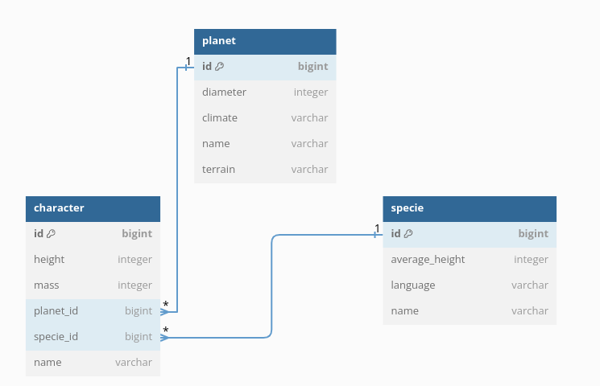
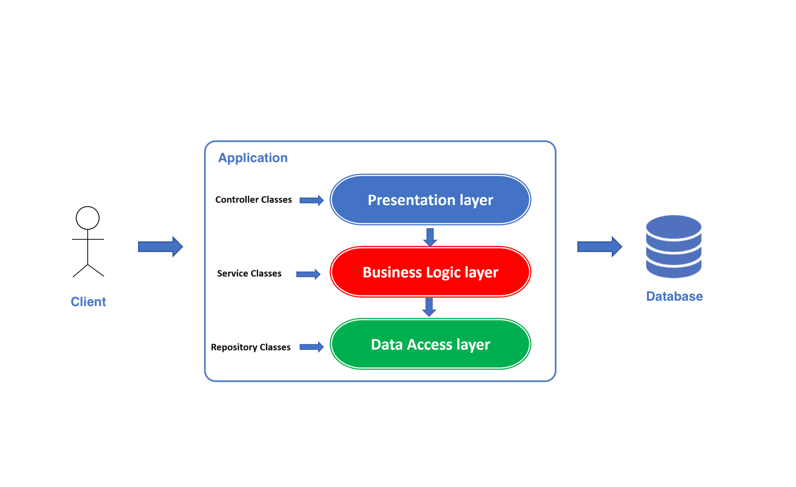

## Star Wars API
**Swagger link:** http://localhost:8080/swagger-ui/index.html

**Db console link:** http://localhost:8080/h2-console

**username:** da  
**password:** 1234

## DB schema

## Three Layer Architecture

**Presentation layer:** This is an interface of the application that provides an API which clients interact with. This layer contains Controller Classes with particular endpoints. Controllers work with Services and return data to the clients.

**Business layer:** Contains the business logic of your application, all features and main functionality. The most important code contains in Service Classes. Services passing data between presentation and data layers.

**Data layer:** Is Responsible for interacting with databases to save and restore data. Repository classes are located at this level.

---
## Task 1
Implement getHeaviestCharacterOnPlanet method in CharacterService class. This method should return the heaviest character from the list of characters. 
## Task 2
There is a bug in getHeaviestCharacterBySpecie method in CharacterService. Find and fix it.
## Task 3
Implement the PUT method in the CharacterController class. This method should update the character with the given id.
## Task 4 (Bonus task)
Add a new table to the application called "starship" and create a controller for it. The table should have the following columns:
- id (primary key)
- name

The table should have a OneToMany relationship with the character table